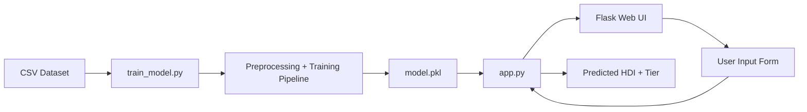
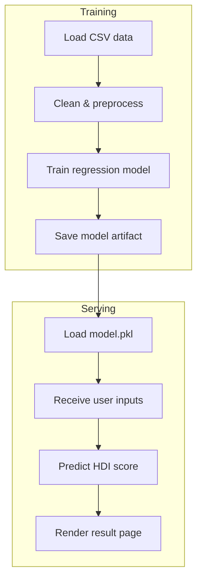

# Human Development Index (HDI) Predictor

A simple Flask web app with a machine learning model for estimating HDI score from country-level development inputs.

## 🚀 Project Overview
This project includes:
- `train_model.py`: loads an HDI dataset, cleans the data, trains a regression model, evaluates performance, and saves the model artifact.
- `app.py`: loads the saved model and serves a web interface for predicting HDI score and tier.
- `templates/`: HTML templates for the web UI.
- `static/`: CSS styling for the app.
- `data/hdi_sample.csv`: example dataset used for training.

## ✨ What it does
- Reads a CSV dataset with HDI features
- Preprocesses missing values and numeric data
- Trains a `scikit-learn` regression pipeline
- Evaluates the model using MSE and R²
- Saves the trained model to `model.pkl`
- Serves a Flask app for live predictions

## � Architecture diagram


## 🔄 Workflow diagram


## �🧠 Model inputs
The app accepts these feature values:
- Life Expectancy
- Mean Years of Schooling
- Expected Years of Schooling
- GNI per Capita

The app returns:
- Predicted HDI score
- Tier label: `Very High`, `High`, `Medium`, or `Low`

## 📁 Project structure
- `app.py` — Flask app for prediction UI
- `train_model.py` — training pipeline and model exporter
- `model.pkl` — generated model artifact after training
- `data/hdi_sample.csv` — example CSV dataset
- `templates/index.html` — input form page
- `templates/result.html` — prediction result page
- `static/styles.css` — page styling

## 🛠️ Setup
### 1) Create a Python environment
Recommended using virtualenv or conda:

Using `venv`:
```bash
python -m venv venv
venv\Scripts\activate
```

Using `conda`:
```bash
conda create -n hdi-predictor python=3.13 -y
conda activate hdi-predictor
```

### 2) Install dependencies
```bash
pip install flask scikit-learn pandas numpy
```

## 🧪 Train the model
Use your CSV dataset or the sample dataset in `data/hdi_sample.csv`.

```bash
python train_model.py --data data/hdi_sample.csv --model-out model.pkl
```

Expected output:
- Evaluation metrics printed to the console
- `model.pkl` file created in the project folder

## 🌐 Run the Flask app
After training, start the web app:

```bash
python app.py
```

Open the browser at:

```text
http://127.0.0.1:5000/
```

## 📝 Notes
- If your dataset uses different column names, update `infer_columns()` or the `FEATURE_COLUMNS` / `TARGET_COLUMN` definitions in `train_model.py`.
- `model.pkl` must exist before running `app.py`.

## 💡 Tips for use
- Use the sample dataset to verify the workflow first.
- Customize the input labels in `templates/index.html` to match your dataset.
- Add more features or model types later if you want better prediction accuracy.

## 📌 Example commands
Train:
```bash
python train_model.py --data data/hdi_sample.csv --model-out model.pkl
```

Run app:
```bash
python app.py
```

